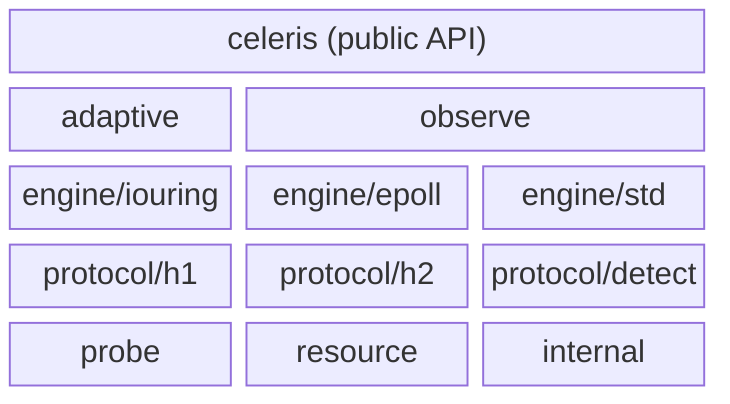

# celeris

[](https://github.com/goceleris/celeris/actions/workflows/ci.yml)
[](https://pkg.go.dev/github.com/goceleris/celeris)
[](https://goreportcard.com/report/github.com/goceleris/celeris)
[](LICENSE)

Ultra-low latency Go HTTP engine with a protocol-aware dual-architecture (io_uring & epoll) designed for high-throughput infrastructure and zero-allocation microservices. It provides a familiar route-group and middleware API similar to Gin and Echo, so teams can adopt it without learning a new programming model.

## Features

- **Tiered io_uring** — auto-selects the best io_uring feature set (multishot accept, provided buffers, SQ poll) for your kernel
- **Edge-triggered epoll** — per-core event loops with CPU pinning
- **Adaptive meta-engine** — dynamically switches between io_uring and epoll based on runtime telemetry
- **SIMD HTTP parser** — SSE2 (amd64) and NEON (arm64) with generic SWAR fallback
- **HTTP/2 cleartext (h2c)** — full stream multiplexing, flow control, HPACK
- **Auto-detect** — protocol negotiation from the first bytes on the wire
- **Error-returning handlers** — `HandlerFunc` returns `error`; structured `HTTPError` for status codes
- **Serialization** — JSON and XML response methods (`JSON`, `XML`); Protocol Buffers available via [`github.com/goceleris/middlewares`](https://github.com/goceleris/middlewares); `Bind` auto-detects request format from Content-Type
- **net/http compatibility** — wrap existing `http.Handler` via `celeris.Adapt()`
- **Built-in metrics collector** — atomic counters, always-on `Server.Collector().Snapshot()`

## API Overview

| Type | Package | Description |
|------|---------|-------------|
| `Server` | `celeris` | Top-level entry point; owns config, router, engine |
| `Config` | `celeris` | Server configuration (addr, engine, protocol, timeouts) |
| `Context` | `celeris` | Per-request context with params, headers, body, response methods |
| `HandlerFunc` | `celeris` | `func(*Context) error` — handler/middleware signature |
| `HTTPError` | `celeris` | Structured error carrying HTTP status code and message |
| `RouteGroup` | `celeris` | Group of routes sharing a prefix and middleware |
| `Route` | `celeris` | Opaque handle to a registered route |
| `Collector` | `observe` | Lock-free request metrics aggregator |
| `Snapshot` | `observe` | Point-in-time copy of all collected metrics |

## Architecture



## Quick Start

```
go get github.com/goceleris/celeris@latest
```

Requires **Go 1.26+**. Linux for io_uring/epoll engines; any OS for the std engine.

## Hello World

```go
package main

import (
	"log"

	"github.com/goceleris/celeris"
)

func main() {
	s := celeris.New(celeris.Config{Addr: ":8080"})
	s.GET("/hello", func(c *celeris.Context) error {
		return c.String(200, "Hello, World!")
	})
	log.Fatal(s.Start())
}
```

## Routing

```go
s := celeris.New(celeris.Config{Addr: ":8080"})

// Static routes
s.GET("/health", healthHandler)

// Named parameters
s.GET("/users/:id", func(c *celeris.Context) error {
	id := c.Param("id")
	return c.JSON(200, map[string]string{"id": id})
})

// Catch-all wildcards
s.GET("/files/*path", staticFileHandler)

// Route groups
api := s.Group("/api")
api.GET("/items", listItems)
api.POST("/items", createItem)

// Nested groups
v2 := api.Group("/v2")
v2.GET("/items", listItemsV2)
```

## Middleware

Middleware is provided by the [`goceleris/middlewares`](https://github.com/goceleris/middlewares) module — one subpackage per middleware, individually importable.

```go
import (
	"github.com/goceleris/middlewares/logger"
	"github.com/goceleris/middlewares/recovery"
	"github.com/goceleris/middlewares/cors"
	"github.com/goceleris/middlewares/ratelimit"
)

s := celeris.New(celeris.Config{Addr: ":8080"})
s.Use(recovery.New())
s.Use(logger.New(slog.Default()))

api := s.Group("/api")
api.Use(ratelimit.New(1000))
api.Use(cors.New(cors.Config{
	AllowOrigins: []string{"https://example.com"},
}))
```

See the [middlewares repo](https://github.com/goceleris/middlewares) for the full list: Logger, Recovery, CORS, RateLimit, RequestID, Timeout, BodyLimit, BasicAuth, JWT, CSRF, Session, Metrics, Debug, Compress, and more.

### Writing Custom Middleware

Middleware is just a `HandlerFunc` that calls `c.Next()`:

```go
func Timing() celeris.HandlerFunc {
	return func(c *celeris.Context) error {
		start := time.Now()
		err := c.Next()
		dur := time.Since(start)
		slog.Info("request", "path", c.Path(), "duration", dur, "error", err)
		return err
	}
}

s.Use(Timing())
```

The `error` returned by `c.Next()` is the first non-nil error from any downstream handler. Middleware can inspect, wrap, or swallow the error before returning.

## Error Handling

`HandlerFunc` has the signature `func(*Context) error`. Returning a non-nil error propagates it up through the middleware chain. If no middleware handles the error, the router's safety net converts it to an HTTP response:

- `*HTTPError` — responds with `Code` and `Message` from the error.
- Any other `error` — responds with `500 Internal Server Error`.

```go
// Return a structured HTTP error
s.GET("/item/:id", func(c *celeris.Context) error {
	item, err := store.Find(c.Param("id"))
	if err != nil {
		return celeris.NewHTTPError(404, "item not found").WithError(err)
	}
	return c.JSON(200, item)
})

// Middleware can intercept errors from downstream handlers
func ErrorLogger() celeris.HandlerFunc {
	return func(c *celeris.Context) error {
		err := c.Next()
		if err != nil {
			slog.Error("handler error", "path", c.Path(), "error", err)
		}
		return err
	}
}
```

## Configuration

```go
s := celeris.New(celeris.Config{
	Addr:            ":8080",
	Protocol:        celeris.Auto,       // HTTP1, H2C, or Auto
	Engine:          celeris.Adaptive,    // IOUring, Epoll, Adaptive, or Std
	Workers:         8,
	Objective:       celeris.Latency,    // Latency, Throughput, or Balanced
	ReadTimeout:     30 * time.Second,
	WriteTimeout:    30 * time.Second,
	IdleTimeout:     120 * time.Second,
	ShutdownTimeout: 10 * time.Second,   // max wait for in-flight requests (default 30s)
	Logger:          slog.Default(),
})
```

## net/http Compatibility

Wrap existing `net/http` handlers and middleware:

```go
// Wrap http.Handler
s.GET("/legacy", celeris.Adapt(legacyHandler))

// Wrap http.HandlerFunc
s.GET("/func", celeris.AdaptFunc(func(w http.ResponseWriter, r *http.Request) {
	w.Write([]byte("from stdlib"))
}))
```

The bridge buffers the adapted handler's response in memory, capped at **100 MB**. Responses exceeding this limit return an error.

## Engine Selection

| Engine | Platform | Use Case |
|--------|----------|----------|
| `IOUring` | Linux 5.10+ | Lowest latency, highest throughput |
| `Epoll` | Linux | Broad kernel support, proven stability |
| `Adaptive` | Linux | Auto-switch based on telemetry |
| `Std` | Any OS | Development, compatibility, non-Linux deploys |

Use Adaptive (the default on Linux) unless you have a specific reason to pin an engine. On non-Linux platforms, only Std is available.

## Performance Profiles

| Profile | Optimizes For | Key Tuning |
|---------|---------------|------------|
| `celeris.Latency` | P99 tail latency | TCP_NODELAY, small batches, SO_BUSY_POLL |
| `celeris.Throughput` | Max RPS | Large CQ batches, write batching |
| `celeris.Balanced` | Mixed workloads | Default settings |

## Graceful Shutdown

Use `StartWithContext` for production deployments. When the context is canceled, the server drains in-flight requests up to `ShutdownTimeout` (default 30s).

```go
ctx, stop := signal.NotifyContext(context.Background(), os.Interrupt, syscall.SIGTERM)
defer stop()

s := celeris.New(celeris.Config{
	Addr:            ":8080",
	ShutdownTimeout: 15 * time.Second,
})
s.GET("/hello", helloHandler)

if err := s.StartWithContext(ctx); err != nil {
	log.Fatal(err)
}
```

## Observability

The core provides a lightweight metrics collector accessible via `Server.Collector()`:

```go
snap := server.Collector().Snapshot()
fmt.Println(snap.RequestsTotal, snap.ErrorsTotal, snap.ActiveConns)
```

For Prometheus exposition and debug endpoints, use the [`middlewares/metrics`](https://github.com/goceleris/middlewares) and [`middlewares/debug`](https://github.com/goceleris/middlewares) packages.

## Feature Matrix

| Feature | io_uring | epoll | std |
|---------|----------|-------|-----|
| HTTP/1.1 | yes | yes | yes |
| H2C | yes | yes | yes |
| Auto-detect | yes | yes | yes |
| CPU pinning | yes | yes | no |
| Provided buffers | yes (5.19+) | no | no |
| Multishot accept | yes (5.19+) | no | no |

## Benchmarks

Framework overhead on 8 vCPU (arm64 c6g.2xlarge, x86 c5a.2xlarge):

- **<1.5%** overhead vs raw engine (balanced mode)
- All 3 engines within **0.3%** of each other (adaptive fully matches dedicated)
- Beats Fiber by **+1.4-2.1%** (arm64), **+0.7-1.3%** (x86)
- Beats echo/chi/gin/iris by **5-6%**
- H2 overhead: **1.5%** vs Go frameworks' **16.6%** (11x smaller)

Methodology: 27 server configurations (3 engines x 3 objectives x 3 protocols) tested with `wrk2` at fixed request rates. Full results and reproduction scripts are in the [benchmarks repo](https://github.com/goceleris/benchmarks).

## Requirements

- **Go 1.26+**
- **Linux** for io_uring and epoll engines
- **Any OS** for the std engine
- Dependencies: `golang.org/x/sys`, `golang.org/x/net`

## Project Structure

```
adaptive/       Adaptive meta-engine (Linux)
engine/         Engine interface + implementations (iouring, epoll, std)
internal/       Shared internals (conn, cpumon, platform, sockopts)
observe/        Lightweight metrics collector (atomic counters, Snapshot)
probe/          System capability detection
protocol/       Protocol parsers (h1, h2, detect)
resource/       Configuration, presets, objectives
test/           Conformance, spec compliance, integration, benchmarks
```

## Contributing

```bash
go install github.com/magefile/mage@latest  # one-time setup
mage build   # build all targets
mage test    # run tests
mage lint    # run linters
mage bench   # run benchmarks
```

Pull requests should target `main`.

## License

[Apache License 2.0](LICENSE)
