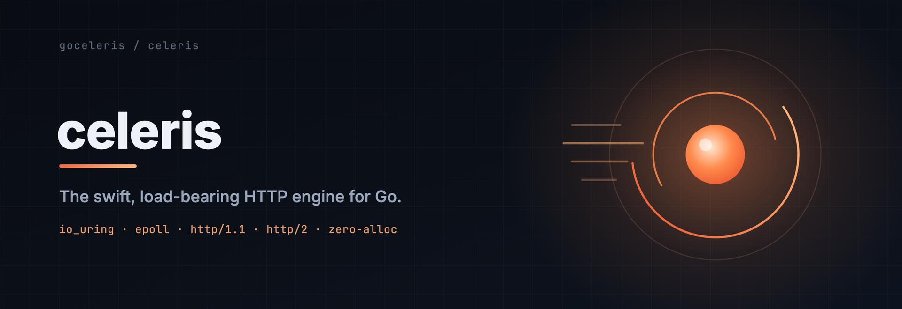
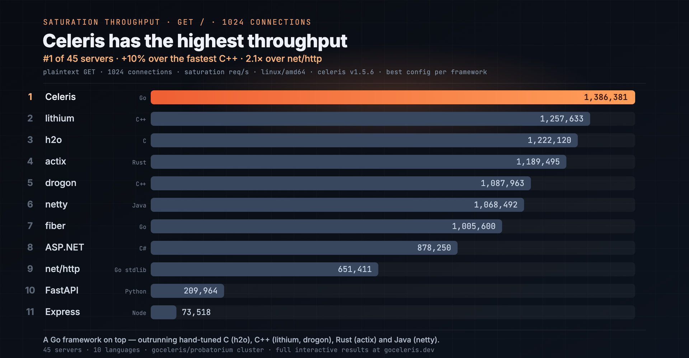

<p align="center">
  
</p>

# celeris

[](https://github.com/goceleris/celeris/actions/workflows/ci.yml)
[](https://github.com/goceleris/probatorium/actions/workflows/matrix-nightly-tier.yml?query=branch%3Amain)
[](https://github.com/goceleris/probatorium/actions/workflows/matrix-weekend-tier.yml?query=branch%3Amain)
[](https://pkg.go.dev/github.com/goceleris/celeris)
[](https://goreportcard.com/report/github.com/goceleris/celeris)
[](LICENSE)

celeris is a high-throughput, load-bearing HTTP engine for Go, built on a protocol-aware dual architecture of io_uring and epoll. Its standout strength is throughput under load: across the [probatorium](https://github.com/goceleris/probatorium) cross-framework matrix it leads the field on driver-backed (PostgreSQL / Redis / memcached) and write-heavy workloads, sustaining the highest request rates while holding tail-latency SLOs — powered by first-party database drivers that run their socket I/O on the same event loop as your handlers. The API is a familiar route-group and middleware model in the spirit of Gin and Echo, so teams adopt it without learning a new programming model, with zero-allocation hot paths on the HTTP/1.1 and h2c fast paths.

Full documentation lives at [goceleris.dev](https://goceleris.dev).

## Highlights

- **io_uring and epoll at parity** — both native engines deliver equivalent throughput; an adaptive meta-engine picks and transplants between them at runtime.
- **Inline broadcast egress** (v1.5.7) — WebSocket and SSE fan-out now writes inline on the dispatch goroutine on native engines, lifting the single-loop-thread broadcast ceiling.
- **Zero hot-path allocations** on the HTTP/1.1 and h2c fast paths — pool-based contexts and pre-encoded HPACK responses.
- **First-party event-loop drivers** — native PostgreSQL, Redis, and memcached clients that colocate socket I/O with your handlers, no CGo, no separate reactor.
- **Continuously validated** — an adversarial [probatorium](https://github.com/goceleris/probatorium) cluster matrix runs nightly, plus a deeper weekend soak; see the badges above.

## What's new in v1.5.8

A correctness-focused release. Three concurrency fixes on the WebSocket and engine paths: a WebSocket-upgrade crash (a `chanReader` send-on-closed-channel panic when a peer RSTs mid-upgrade, now redesigned around a single-close done-channel), a Context/stream use-after-recycle in the epoll and io_uring engines during async upgrade, and HTTP/2 write-queue plus overload-manager hardening. Validated with a clean 24h weekend soak on both amd64 and arm64 (zero high-severity invariant violations), and an interleaved A/B benchmark confirming no throughput regression versus v1.5.7.

## Features

- **Tiered io_uring** — auto-selects the best io_uring feature set (multishot accept/recv, provided buffers, SQ poll, fixed files) for your kernel.
- **Edge-triggered epoll** — per-core event loops with CPU pinning.
- **Adaptive meta-engine** — transplants between io_uring and epoll at runtime based on telemetry.
- **First-party database drivers** — native [`driver/postgres`](driver/postgres), [`driver/redis`](driver/redis), and [`driver/memcached`](driver/memcached) run on the celeris event loop (see [Database drivers](#database-drivers)).
- **SIMD HTTP parser** — SSE2 (amd64) and NEON (arm64) with a generic SWAR fallback.
- **HTTP/2 cleartext (h2c)** — full stream multiplexing, flow control, HPACK, inline handler execution, zero-alloc HEADERS fast path.
- **Auto-detect** — protocol negotiation from the first bytes on the wire.
- **Error-returning handlers** — `HandlerFunc` returns `error`; structured `*HTTPError` carries status codes.
- **Pre-routing middleware** — `Server.Pre()` runs middleware before route matching (method override, URL rewrite).
- **Serialization** — JSON and XML response methods; `Bind` auto-detects request format from `Content-Type`.
- **net/http compatibility** — wrap an existing `http.Handler` via `celeris.Adapt()` / `celeris.AdaptFunc()`.
- **Streaming responses** — `StreamWriter()` for chunked incremental writes on any engine; `Detach()` for keep-alive-after-return streaming on native engines (see [Streaming](#streaming-sse--websocket--chunked)).
- **Connection hijacking** — `Hijack()` for custom protocol upgrades (HTTP/1.1 only).
- **Engine-integrated WebSocket** — `UpgradeWebSocket()` hands the conn to the worker loop with backpressure, permessage-deflate, and a `Hub` for fan-out broadcast.
- **Response buffering** — `BufferResponse` / `FlushResponse` for transform middleware (compress, ETag, cache).
- **File serving** — `File()` from the OS, `FileFromFS()` from `embed.FS` / `fs.FS`.
- **Content negotiation** — `Negotiate`, `Respond`, `AcceptsEncodings`, `AcceptsLanguages`.
- **Configurable body limits** — `MaxRequestBodySize` enforced on HTTP/1.1 and h2c (the net/http bridge has a fixed 100 MB cap).
- **100-continue control** — `OnExpectContinue` callback validates uploads before the body transfers.
- **Accept control** — `PauseAccept()` / `ResumeAccept()` for graceful load shedding.
- **Zero-downtime restart** — `InheritListener` + `StartWithListener` for socket inheritance.
- **Built-in metrics** — atomic counters, CPU-utilization sampling, on by default via `Server.Collector().Snapshot()` (opt out with `Config.DisableMetrics`).
- **Per-route async dispatch** — `Route.Async()` / `Route.Sync()` choose inline-on-worker vs. per-conn dispatch goroutine per route; h2 chooses per stream.

**TLS:** the io_uring / epoll engines speak cleartext only (HTTP/1.1 + h2c). Terminate TLS upstream (Caddy, Nginx, Envoy) or use the std engine for in-process HTTPS.

## Quick start

```
go get github.com/goceleris/celeris@latest
```

Requires **Go 1.26.4+**. Linux for the io_uring / epoll / adaptive engines; any OS for the std engine.

```go
package main

import (
	"log"

	"github.com/goceleris/celeris"
)

func main() {
	s := celeris.New(celeris.Config{Addr: ":8080"})
	s.GET("/hello", func(c *celeris.Context) error {
		return c.String(200, "Hello, World!")
	})
	log.Fatal(s.Start())
}
```

## Routing

```go
s := celeris.New(celeris.Config{Addr: ":8080"})

// Static routes
s.GET("/health", healthHandler)

// Named parameters
s.GET("/users/:id", func(c *celeris.Context) error {
	id := c.Param("id")
	return c.JSON(200, map[string]string{"id": id})
})

// Catch-all wildcards
s.GET("/files/*path", staticFileHandler)

// Route groups with middleware
api := s.Group("/api")
api.Use(authMiddleware)
api.GET("/items", listItems)
api.POST("/items", createItem)

// Named routes + reverse URL generation
s.GET("/users/:id", showUser).Name("user")
url, _ := s.URL("user", "42") // "/users/42"

// Pre-routing middleware (runs before route matching)
s.Pre(methodOverride, urlRewrite)
```

## Middleware

All middleware is in-tree under [`middleware/`](middleware/) — 36 importable packages:

| Package | Description |
|---------|-------------|
| [`adapters`](middleware/adapters) | Bidirectional stdlib ↔ celeris middleware/handler conversion |
| [`basicauth`](middleware/basicauth) | HTTP Basic authentication with hashed password support |
| [`bodylimit`](middleware/bodylimit) | Request body size enforcement |
| [`cache`](middleware/cache) | HTTP response cache with singleflight + Cache-Control honoring |
| [`circuitbreaker`](middleware/circuitbreaker) | Circuit breaker (3-state, sliding-window error rate, 503 + Retry-After) |
| [`compress`](middleware/compress) | Response compression (zstd, brotli, gzip, deflate; separate go.mod) |
| [`cors`](middleware/cors) | Cross-Origin Resource Sharing (zero-alloc) |
| [`csrf`](middleware/csrf) | CSRF protection (double-submit cookie + origin validation) |
| [`debug`](middleware/debug) | Debug / introspection endpoints (loopback-only by default) |
| [`etag`](middleware/etag) | Automatic ETag generation and conditional 304 responses |
| [`healthcheck`](middleware/healthcheck) | Kubernetes-style liveness / readiness / startup probes |
| [`idempotency`](middleware/idempotency) | Idempotency-Key replay protection (in-flight 409 + cached replay) |
| [`jwt`](middleware/jwt) | JWT authentication (HMAC / RSA / ECDSA / EdDSA, JWKS auto-refresh) |
| [`keyauth`](middleware/keyauth) | API-key authentication with constant-time comparison |
| [`logger`](middleware/logger) | Structured request logging (slog, zero-alloc FastHandler) |
| [`methodoverride`](middleware/methodoverride) | HTTP method override via header or form field |
| [`metrics`](middleware/metrics) | Prometheus metrics (separate go.mod) |
| [`otel`](middleware/otel) | OpenTelemetry tracing + metrics (separate go.mod) |
| [`overload`](middleware/overload) | 5-stage CPU + queue-depth + tail-latency-EMA overload control (503 + Retry-After) |
| [`pprof`](middleware/pprof) | Go profiling endpoints (loopback-only by default) |
| [`protobuf`](middleware/protobuf) | Protobuf serialization with content negotiation (separate go.mod) |
| [`proxy`](middleware/proxy) | Trusted-proxy header extraction (X-Forwarded-For, X-Real-IP) |
| [`ratelimit`](middleware/ratelimit) | Sharded token-bucket / sliding-window rate limiter (Redis / memcached store adapters) |
| [`recovery`](middleware/recovery) | Panic recovery with broken-pipe detection |
| [`redirect`](middleware/redirect) | URL redirect / rewrite (HTTPS, www, trailing slash) |
| [`requestid`](middleware/requestid) | Request-ID generation (buffered UUID v4) |
| [`rewrite`](middleware/rewrite) | Regex-based URL rewriting with capture-group support |
| [`secure`](middleware/secure) | Security headers (HSTS, CSP, COOP/CORP/COEP, OWASP defaults) |
| [`session`](middleware/session) | Cookie-based sessions on the unified [`store.KV`](middleware/store) (memory / Redis / Postgres / memcached adapters) |
| [`singleflight`](middleware/singleflight) | Request coalescing (collapse identical in-flight requests) |
| [`sse`](middleware/sse) | Server-Sent Events: heartbeat, Last-Event-ID replay, per-client slow-client policy, and a `Broker` for fan-out (see [Streaming](#streaming-sse--websocket--chunked)) |
| [`static`](middleware/static) | Static file serving with directory browse, ETag / Last-Modified caching |
| [`store`](middleware/store) | Unified in-memory `KV` (sharded, TTL eviction) shared by session / csrf / ratelimit / cache / idempotency; Redis / Postgres / memcached adapters live under the respective `session/*store` and `ratelimit/*store` subpackages |
| [`swagger`](middleware/swagger) | OpenAPI spec + Swagger UI / Scalar / ReDoc (CDN-loaded) |
| [`timeout`](middleware/timeout) | Request timeout with cooperative and preemptive modes |
| [`websocket`](middleware/websocket) | RFC 6455 WebSocket: permessage-deflate, engine-integrated backpressure, and a `Hub` for fan-out (see [Streaming](#streaming-sse--websocket--chunked)) |

```go
import (
	"github.com/goceleris/celeris/middleware/cors"
	"github.com/goceleris/celeris/middleware/logger"
	"github.com/goceleris/celeris/middleware/recovery"
)

s := celeris.New(celeris.Config{Addr: ":8080"})
s.Use(recovery.New())
s.Use(logger.New())
s.Use(cors.New())
```

Middleware with external dependencies lives in its own module — import it separately:

```go
import "github.com/goceleris/celeris/middleware/metrics" // requires prometheus
import "github.com/goceleris/celeris/middleware/otel"    // requires opentelemetry
```

## Error handling

`HandlerFunc` has the signature `func(*Context) error`. Returning a non-nil error propagates it up through the middleware chain. If no middleware handles it, the router's safety net converts it to an HTTP response:

- `*HTTPError` — responds with its `Code` and `Message`.
- Any other `error` — responds with `500 Internal Server Error`.

```go
// Return a structured HTTP error
s.GET("/item/:id", func(c *celeris.Context) error {
	item, err := store.Find(c.Param("id"))
	if err != nil {
		return celeris.NewHTTPError(404, "item not found").WithError(err)
	}
	return c.JSON(200, item)
})

// Use Status() + StatusJSON() for fluent responses
s.POST("/items", func(c *celeris.Context) error {
	var item Item
	if err := c.Bind(&item); err != nil {
		return celeris.NewHTTPError(400, "invalid body").WithError(err)
	}
	created := store.Create(item)
	return c.Status(201).StatusJSON(created)
})
```

## Configuration

```go
s := celeris.New(celeris.Config{
	Addr:               ":8080",
	Protocol:           celeris.Auto,      // HTTP1, H2C, or Auto
	Engine:             celeris.Adaptive,  // IOUring, Epoll, Adaptive, or Std
	Workers:            8,
	ReadTimeout:        30 * time.Second,
	WriteTimeout:       30 * time.Second,
	IdleTimeout:        120 * time.Second,
	ShutdownTimeout:    10 * time.Second,  // max wait for in-flight requests (default 30s)
	MaxRequestBodySize: 50 << 20,          // 50 MB (default 100 MB, -1 for unlimited)
	AsyncHandlers:      false,             // server-level default (per-route .Async() overrides)
	Logger:             slog.Default(),
})
```

## Async handlers (per route)

Celeris runs every handler **inline on the I/O worker** by default — lowest latency, zero handoff. For handlers that block on I/O (database, RPC, filesystem), opt **per route** into the per-connection dispatch goroutine so the worker stays free to drive other connections:

```go
// CPU-only / cache-only — runs inline (default).
s.GET("/healthz", healthHandler)

// Blocking I/O — async, runs on a per-conn goroutine.
s.GET("/db", dbHandler).Async()

// Or flip the default at the group level:
api := s.Group("/api").Async()
api.GET("/products", productHandler)     // async (inherited)
api.GET("/cached", cachedHandler).Sync() // opt back to sync
```

Precedence is **route > group > server default** (`Config.AsyncHandlers`). It works identically across io_uring, epoll, and adaptive — both sub-engines honor the per-route flag, and async promotions survive sub-engine swaps: a conn is promoted **once** via the `ErrAsyncDispatch` sentinel (sticky — subsequent requests skip the inline check entirely). h2 routes the choice **per stream** between inline-on-event-loop and the shared h2 worker pool. The `Async` / `Sync` distinction is a no-op on the std engine, where net/http already does goroutine-per-request.

Observe how often the inline → goroutine handoff fires via `Server.EngineInfo().Metrics.AsyncRoutes` (static count of `.Async()` routes) and `.AsyncPromotedConns` (cumulative promotions).

## Streaming (SSE / WebSocket / chunked)

Streaming is a first-class differentiator, and native engines get an inline egress path that avoids funneling every write through one loop thread. Four building blocks compose:

- **`Context.StreamWriter()`** — synchronous incremental writes (chunked / progressive responses). Works on **every** engine, including std.
- **`Context.Detach()`** — keep the connection alive after the handler returns, so a spawned goroutine can drive a long-lived stream. This is **native-engine only** (io_uring / epoll / adaptive). On std, the connection closes the moment the handler returns.
- **[`middleware/websocket`](middleware/websocket)** — RFC 6455 WebSocket with an engine-integrated `Hub` for broadcast.
- **[`middleware/sse`](middleware/sse)** — Server-Sent Events with a `Broker` for publish-to-N fan-out and Last-Event-ID replay.

Gate async streaming on the active engine with `Context.EngineSupportsAsyncDetach()` — it reports whether the engine can keep the conn alive after the handler returns:

```go
func stream(c *celeris.Context) error {
	if c.EngineSupportsAsyncDetach() {
		done := c.Detach()
		go func() {
			defer done()
			driveStream(c) // writes flush through the engine's guarded path
		}()
		return nil // handler returns; conn stays alive
	}
	driveStream(c) // std: must complete before returning
	return nil
}
```

### WebSocket

[`middleware/websocket`](middleware/websocket) is a full RFC 6455 implementation wired directly into the worker loop:

- **Zero-alloc reads** — `Conn.ReadMessageReuse()` reuses a caller buffer for echo / proxy hot paths.
- **Streaming large messages** — `Conn.NextReader()` / `Conn.NextWriter()` read and write without whole-message buffering.
- **Control frames** — `Conn.WriteControl()`, `Conn.WritePing()`, and `SetPingHandler` / `SetPongHandler` / `SetCloseHandler`.
- **permessage-deflate** — RFC 7692 compression negotiated at handshake (`EnableCompression`).
- **Fan-out `Hub`** — `NewHub(HubConfig{...})`, then `Broadcast` / `BroadcastFilter` / `BroadcastPrepared`. Encode once with `NewPreparedMessage` and reuse the `*PreparedMessage` across every subscriber for O(1) per-message wire-encoding cost. Slow connections are handled by `HubConfig.OnSlowConn`, which returns a `HubPolicy` (Drop / Remove / Close).

### SSE

[`middleware/sse`](middleware/sse) provides heartbeats, Last-Event-ID replay via a pluggable `ReplayStore`, and a fan-out `Broker`:

- **`NewBroker(BrokerConfig{...})`** — publish to N subscribers, each with a bounded queue.
- **`BrokerConfig.OnSlowSubscriber`** — returns a `BrokerPolicy` (Drop / Remove / Close) when a subscriber's queue is full; slow-subscriber handling is bounded by `DefaultBrokerSlowConcurrency()` (`GOMAXPROCS*4`) so a misbehaving callback can't fan out unboundedly.
- **Last-Event-ID replay** — on reconnect the broker reads `Since(lastID)` from the replay store and re-sends missed events.

## Database drivers

Celeris ships first-party, event-loop-native database drivers that run their socket I/O on the **same worker loop** as your HTTP handlers — no CGo, no separate reactor thread. They back the driver-isolation benchmarks and probatorium's driver-backed workloads, where celeris's dominance is widest.

- **[`driver/postgres`](driver/postgres)** — speaks the PostgreSQL v3 wire protocol directly. Register it as a standard `database/sql` driver, or use the lower-level worker-affinity `Pool` to skip `database/sql` overhead.
- **[`driver/redis`](driver/redis)** — RESP2 / RESP3 client (negotiates `HELLO 3` with automatic RESP2 fallback), per-worker connection pools, pub/sub, and Redis Cluster + Sentinel failover.
- **[`driver/memcached`](driver/memcached)** — text and binary protocols, pooled single-node clients, and a consistent-hash cluster with failover.

Colocate a driver with the server via its `WithEngine` option so commands issue on the loop instead of dialing out on a blocking goroutine. See [goceleris.dev](https://goceleris.dev) for driver guides.

## net/http compatibility

Wrap existing `net/http` handlers and middleware:

```go
// Wrap http.Handler
s.GET("/legacy", celeris.Adapt(legacyHandler))

// Wrap http.HandlerFunc
s.GET("/func", celeris.AdaptFunc(func(w http.ResponseWriter, r *http.Request) {
	w.Write([]byte("from stdlib"))
}))
```

The bridge buffers the adapted handler's response in memory, capped at a compile-time **100 MB** limit (independent of `Config.MaxRequestBodySize`). Responses exceeding this limit return an error.

## Engine selection

| Engine | Platform | Use case |
|--------|----------|----------|
| `IOUring` | Linux 5.10+ | Lowest latency, highest throughput |
| `Epoll` | Linux | Broad kernel support, proven stability |
| `Adaptive` | Linux | Auto-switch between io_uring and epoll on telemetry |
| `Std` | Any OS | Development, compatibility, non-Linux deploys |

The default is **Adaptive** on Linux and **Std** elsewhere. Prefer Adaptive unless you have a specific reason to pin an engine; on non-Linux platforms only Std is available (the native engines return an error).

## Graceful shutdown

Use `StartWithContext` for production. When the context is canceled, the server drains in-flight requests up to `ShutdownTimeout` (default 30s).

```go
ctx, stop := signal.NotifyContext(context.Background(), os.Interrupt, syscall.SIGTERM)
defer stop()

s := celeris.New(celeris.Config{
	Addr:            ":8080",
	ShutdownTimeout: 15 * time.Second,
})
s.GET("/hello", helloHandler)

if err := s.StartWithContext(ctx); err != nil {
	log.Fatal(err)
}
```

## Observability

The core provides a lightweight metrics collector via `Server.Collector()`:

```go
snap := server.Collector().Snapshot()
fmt.Println(snap.RequestsTotal, snap.ErrorsTotal, snap.ActiveConns, snap.CPUUtilization)
```

For Prometheus exposition and debug endpoints, use [`middleware/metrics`](middleware/metrics) and [`middleware/debug`](middleware/debug). For OpenTelemetry, use [`middleware/otel`](middleware/otel).

## Feature matrix

| Feature | io_uring | epoll | std |
|---------|----------|-------|-----|
| HTTP/1.1 | yes | yes | yes |
| h2c | yes | yes | yes |
| Auto-detect | yes | yes | yes |
| CPU pinning | yes | yes | no |
| Provided buffers | yes (5.19+) | no | no |
| Multishot accept | yes (5.19+) | no | no |
| Multishot recv | opt-in (5.19+, `CELERIS_IOURING_MULTISHOT_RECV=1`) | no | no |
| Provided-buffer ring size | auto-scaled (`CELERIS_IOURING_PBUF_COUNT=N` to override) | n/a | n/a |
| Zero-alloc HEADERS | yes | yes | no |
| Inline h2 handlers | yes | yes | no |
| Inline WS / SSE broadcast egress | yes | yes | n/a (net/http) |
| `StreamWriter` (sync incremental) | yes | yes | yes |
| `Detach` (async keep-alive) | yes | yes | no |
| Connection hijack | yes | yes | yes |

`StreamWriter()` performs synchronous incremental writes on every engine. Async `Detach()` — keeping the connection alive after the handler returns — is native-engines-only (`EngineSupportsAsyncDetach()` is false on std, which closes the conn when the handler returns).

## Benchmarks

<p align="center">
  
</p>

<p align="center"><em>Plaintext GET at 1024 connections, saturation req/s, linux/amd64.</em></p>

celeris tops the plaintext-GET throughput leaderboard shown above — ahead of hand-tuned C, C++, Rust, and Java servers. Across the full published matrix (52 servers, 10 languages), the headline is **fastest Go framework in 26 of 29 scenarios**, sweeping the driver-backed database workloads. Benchmarks run on amd64; arm64 is fully validated in the nightly and weekend soak matrix but excluded from the benchmark target pending an upstream kernel NIC fix on the arm test board ([#312](https://github.com/goceleris/celeris/issues/312)). Full interactive results are at [goceleris.dev](https://goceleris.dev).

The cross-framework matrix (scenario × server × protocol, driven by [`goceleris/loadgen`](https://github.com/goceleris/loadgen)) lives in [`goceleris/probatorium`](https://github.com/goceleris/probatorium), the authoritative bench harness; its `publish-results` workflow emits the release-gate numbers. In-tree comparison modules run in isolation:

- [`test/drivercmp/`](test/drivercmp/) — PostgreSQL / Redis / memcached driver-isolation benchmarks (one module each).
- [`test/benchcmp_ws/`](test/benchcmp_ws/) — WebSocket comparisons.
- [`test/benchcmp_sse/`](test/benchcmp_sse/) — SSE broadcast (publish-to-N) comparisons.

> **Note:** In-tree middleware benchmarks (e.g. `middleware/compress/bench_test.go`) use `celeristest`, which provides pool-based contexts with no HTTP overhead. Those numbers measure pure middleware logic and should not be compared directly with `httptest`-based competitor benchmarks. Use [probatorium](https://github.com/goceleris/probatorium) for fair cross-framework comparisons.

## Continuous validation

Correctness is validated by [`goceleris/probatorium`](https://github.com/goceleris/probatorium), an adversarial cluster matrix run on real hardware:

- **PR tier** (`matrix-pr-tier`) — fast gate that every celeris PR must pass before merge.
- **Nightly** (`matrix-nightly-tier`) — 24 cells across every refapp × every engine, exercising every protocol slice per cell; ~1h budget, every night.
- **Weekend soak** (`matrix-weekend-tier`) — the same matrix at higher request counts for multi-hour endurance.

Bug oracles include slowloris hang detection, malformed-request acceptance, WebSocket torture-frame acceptance, h2c churn-crash detection, and tier-3 property seeds. Badge status is above.

## Project structure

```
adaptive/       Adaptive meta-engine (Linux)
celeristest/    Test helpers (NewContext, NewContextT, ResponseRecorder, With* options)
cmd/celeris/    CLI launcher — validation / diagnostics entrypoint (see below)
driver/         First-party event-loop database drivers (postgres, redis, memcached)
engine/         Engine interface + implementations (iouring, epoll, std)
internal/       Shared internals (conn, cpumon, ctxkit, negotiate, platform, sockopts)
middleware/     In-tree middleware ecosystem (36 importable packages)
observe/        Collector, CPUMonitor, Snapshot
probe/          System capability detection (kernel version, io_uring feature probe)
protocol/       Protocol parsers (h1, h2, detect)
resource/       Configuration, presets, defaults
test/           Conformance, spec compliance, integration, benchmarks (drivercmp, benchcmp_ws, benchcmp_sse)
validation/     Runtime invariant assertions + validation hooks (debug builds)
```

`cmd/celeris` is a minimal launcher around `celeris.New`, intended primarily as the entry point for validation soak runs; under the `validation` build tag it also streams assertion counters over a unix socket. Production deployments should embed `celeris.New` directly rather than depend on this binary.

## Requirements

- **Go 1.26.4+**
- **Linux** for the io_uring / epoll / adaptive engines (kernel 5.10+ for io_uring; 5.19+ for the multishot / provided-buffers tier)
- **Any OS** for the std engine
- Direct runtime dependencies: `golang.org/x/sys` and `golang.org/x/net` only (`golang.org/x/text` is indirect)

## Ecosystem

Celeris is one of the [goceleris](https://github.com/goceleris) family:

- **[celeris](https://github.com/goceleris/celeris)** — this repository: the HTTP engine, middleware, and drivers.
- **[loadgen](https://github.com/goceleris/loadgen)** — the load generator that drives the cross-framework matrix.
- **[probatorium](https://github.com/goceleris/probatorium)** — the adversarial correctness + performance bench harness.
- **[docs](https://github.com/goceleris/docs)** — source for [goceleris.dev](https://goceleris.dev).

## Contributing

See [CONTRIBUTING.md](CONTRIBUTING.md) for development setup, testing, and pull-request guidelines.

## License

[Apache License 2.0](LICENSE)
