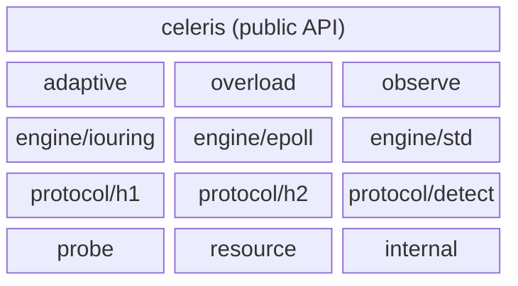

# celeris

[](https://github.com/goceleris/celeris/actions/workflows/ci.yml)
[](https://pkg.go.dev/github.com/goceleris/celeris)
[](https://goreportcard.com/report/github.com/goceleris/celeris)
[](LICENSE)

Ultra-low latency Go HTTP engine with a protocol-aware dual-architecture (io_uring & epoll) designed for high-throughput infrastructure and zero-allocation microservices.

## Features

- **Tiered io_uring** — auto-selects the best io_uring feature set (multishot accept, provided buffers, SQ poll) for your kernel
- **Edge-triggered epoll** — per-core event loops with CPU pinning
- **Adaptive meta-engine** — dynamically switches between io_uring and epoll based on runtime telemetry
- **Overload manager** — 5-stage degradation ladder (expand → reap → reorder → backpressure → reject)
- **SIMD HTTP parser** — SSE2 (amd64) and NEON (arm64) with generic SWAR fallback
- **HTTP/2 cleartext (h2c)** — full stream multiplexing, flow control, HPACK
- **Auto-detect** — protocol negotiation from the first bytes on the wire

## Architecture



## Quick Start

```
go get github.com/goceleris/celeris@latest
```

Requires **Go 1.26+**. Linux for io_uring/epoll engines; any OS for the std engine.

## Hello World

```go
package main

import (
	"context"
	"log"
	"os/signal"
	"syscall"

	"github.com/goceleris/celeris/engine/std"
	"github.com/goceleris/celeris/protocol/h2/stream"
	"github.com/goceleris/celeris/resource"
)

func main() {
	handler := stream.HandlerFunc(func(ctx context.Context, s *stream.Stream) error {
		return s.ResponseWriter.WriteResponse(s, 200, [][2]string{
			{"content-type", "text/plain"},
		}, []byte("Hello, World!"))
	})

	cfg := resource.Config{Addr: ":8080"}
	e, err := std.New(cfg, handler)
	if err != nil {
		log.Fatal(err)
	}

	ctx, stop := signal.NotifyContext(context.Background(), syscall.SIGINT, syscall.SIGTERM)
	defer stop()

	if err := e.Listen(ctx); err != nil {
		log.Fatal(err)
	}
}
```

## Engine Selection

| Engine | Platform | Use Case |
|--------|----------|----------|
| `io_uring` | Linux 5.10+ | Lowest latency, highest throughput |
| `epoll` | Linux | Broad kernel support, proven stability |
| `adaptive` | Linux | Auto-switch based on telemetry |
| `std` | Any OS | Development, compatibility, non-Linux deploys |

## Performance Profiles

| Profile | Optimizes For | Key Tuning |
|---------|---------------|------------|
| `LatencyOptimized` | P99 tail latency | TCP_NODELAY, small batches, SO_BUSY_POLL |
| `ThroughputOptimized` | Max RPS | Large CQ batches, write batching |
| `Balanced` | Mixed workloads | Default settings |

## Feature Matrix

| Feature | io_uring | epoll | std |
|---------|----------|-------|-----|
| HTTP/1.1 | yes | yes | yes |
| H2C | yes | yes | yes |
| Auto-detect | yes | yes | yes |
| CPU pinning | yes | yes | no |
| Provided buffers | yes (5.19+) | no | no |
| Multishot accept | yes (5.19+) | no | no |
| Overload shedding | yes | yes | partial |

## Requirements

- **Go 1.26+**
- **Linux** for io_uring and epoll engines
- **Any OS** for the std engine
- Dependencies: `golang.org/x/sys`, `golang.org/x/net`

## Project Structure

```
adaptive/       Adaptive meta-engine (Linux)
engine/         Engine interface + implementations (iouring, epoll, std)
internal/       Shared internals (conn, cpumon, platform, sockopts)
observe/        Observability (planned)
overload/       Overload manager with 5-stage degradation
probe/          System capability detection
protocol/       Protocol parsers (h1, h2, detect)
resource/       Configuration, presets, objectives
test/           Conformance, spec compliance, integration, benchmarks
```

## Contributing

```bash
go run mage.go build   # build all targets
go run mage.go test    # run tests
go run mage.go lint    # run linters
go run mage.go bench   # run benchmarks
```

Pull requests should target `main`.

## License

[Apache License 2.0](LICENSE)
